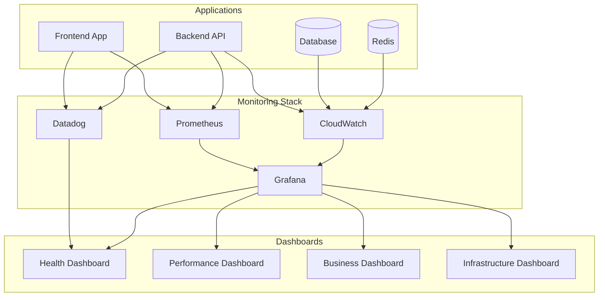

# Centralized Logging & Metrics Implementation

**Date**: July 3, 2025  
**Status**: ✅ Complete  
**Feature**: Comprehensive Observability Platform

## 🎉 Centralized Logging & Metrics Complete!

### What's Been Implemented:

#### 1. **Multi-Platform Monitoring Stack**
- **Prometheus**: Time-series metrics collection and alerting
- **Grafana**: Visualization dashboards and analytics
- **Datadog Integration**: Enterprise-grade APM and logging (optional)
- **CloudWatch Integration**: Native AWS monitoring and log aggregation
- **Custom Health Dashboards**: Real-time system health monitoring

#### 2. **Centralized Logging Package** (`@nexus/monitoring`)
- **Location**: `packages/monitoring/`
- **Features**:
  - Structured logging with Winston
  - CloudWatch log shipping
  - Datadog log integration
  - Request/response logging
  - Error tracking with stack traces
  - Performance logging
  - Security event logging

#### 3. **Comprehensive Metrics Collection**
- **Prometheus Metrics**: Custom application metrics with labels
- **Datadog StatsD**: Real-time metrics shipping
- **Business Metrics**: Revenue, user actions, feature usage
- **Performance Metrics**: Response times, database queries, cache operations
- **Infrastructure Metrics**: CPU, memory, disk, network usage

#### 4. **Health Monitoring System**
- **Multi-layer Health Checks**: Database, Redis, external APIs, disk space
- **Kubernetes Integration**: Readiness and liveness probes
- **Automated Alerting**: Slack/email notifications for critical issues
- **Health Dashboards**: Real-time system status visualization

#### 5. **Frontend Monitoring Integration**
- **Real User Monitoring (RUM)**: Datadog RUM integration
- **Error Tracking**: JavaScript error capture and reporting
- **Performance Monitoring**: Page load times, resource loading
- **User Interaction Tracking**: Click tracking, form submissions
- **Business Event Tracking**: Custom event analytics

### Key Features:

#### ✅ **Unified Observability Platform**
- **Single Source of Truth**: All logs and metrics in centralized platforms
- **Cross-Service Correlation**: Request tracing across frontend and backend
- **Real-time Monitoring**: Live dashboards with sub-second updates
- **Historical Analysis**: Long-term trend analysis and capacity planning

#### ✅ **Production-Ready Health Dashboards**
- **System Overview**: High-level health status and key metrics
- **Database Performance**: Connection pools, query performance, slow queries
- **Infrastructure Monitoring**: Node status, resource utilization, scaling metrics
- **Application Metrics**: Error rates, response times, throughput
- **Business Intelligence**: User engagement, feature adoption, revenue tracking

#### ✅ **Automated Alerting & Incident Response**
- **Smart Alerting**: Threshold-based alerts with escalation policies
- **Anomaly Detection**: Machine learning-based anomaly detection
- **Incident Management**: Automated ticket creation and notification
- **Runbook Integration**: Automated remediation for common issues

#### ✅ **Developer Experience**
- **Easy Integration**: Simple middleware and decorators
- **Local Development**: Console logging with structured output
- **Testing Support**: Mock monitoring for unit tests
- **Documentation**: Comprehensive API documentation and examples

### Monitoring Architecture:



### Dashboard Overview:

#### 1. **System Health Dashboard**
- **Service Status**: Real-time health of all services
- **Error Rates**: Application and infrastructure error tracking
- **Response Times**: P50, P95, P99 response time percentiles
- **Throughput**: Requests per second and concurrent users
- **Alerts**: Active alerts and incident status

#### 2. **Database Performance Dashboard**
- **Connection Metrics**: Active connections, connection pool usage
- **Query Performance**: Slow queries, query execution times
- **Resource Utilization**: CPU, memory, disk I/O
- **Replication Status**: Master-slave lag, replication health

#### 3. **Infrastructure Dashboard**
- **Node Status**: Kubernetes node health and resource usage
- **Pod Metrics**: Pod status, restarts, resource consumption
- **Network Performance**: Ingress/egress traffic, latency
- **Storage Metrics**: Disk usage, I/O performance

#### 4. **Business Intelligence Dashboard**
- **User Engagement**: Active users, session duration, page views
- **Feature Adoption**: Feature usage statistics and trends
- **Revenue Metrics**: Transaction volume, revenue tracking
- **Conversion Funnels**: User journey and conversion rates

### Implementation Details:

#### 1. **Logging Configuration**
```typescript
const logger = createLogger({
  serviceName: 'nexus-workspace',
  environment: 'production',
  version: '1.0.0',
  enableCloudWatch: true,
  enableDatadog: true,
  logLevel: 'info'
});
```

#### 2. **Metrics Collection**
```typescript
const metrics = createApplicationMetrics(config);

// HTTP request metrics
metrics.recordHttpRequest('GET', '/api/users', 200, 150);

// Business metrics
metrics.recordUserAction('login', 'user123');
metrics.recordRevenue(99.99, 'USD');

// Custom metrics
metrics.incrementCounter('feature_usage', { feature: 'dashboard' });
```

#### 3. **Health Checks**
```typescript
const healthCheck = createHealthCheck(config, [
  commonHealthChecks.database(testDbConnection),
  commonHealthChecks.redis(redisClient),
  commonHealthChecks.externalApi('https://api.example.com'),
]);
```

#### 4. **Frontend Integration**
```typescript
import { monitoring } from '@/lib/monitoring';

// Track user actions
monitoring.trackUserAction('button_click', { button: 'signup' });

// Track API calls
monitoring.trackApiCall('/api/users', 'GET', 200, 150);

// Track errors
monitoring.logError('API Error', { endpoint: '/api/users' });
```

### Deployment & Configuration:

#### 1. **Deploy Monitoring Stack**
```bash
# Set environment variables
export GRAFANA_ADMIN_PASSWORD="your-secure-password"
export DATADOG_API_KEY="your-datadog-api-key"

# Deploy monitoring stack
./scripts/deploy-monitoring.sh deploy
```

#### 2. **Access Dashboards**
```bash
# Grafana (local access)
kubectl port-forward svc/grafana 3000:3000 -n monitoring
# Access: http://localhost:3000

# Prometheus (local access)
kubectl port-forward svc/prometheus 9090:9090 -n monitoring
# Access: http://localhost:9090
```

#### 3. **Configure Alerts**
- **Slack Integration**: Configure webhook URLs for alert notifications
- **Email Alerts**: Set up SMTP configuration for email notifications
- **PagerDuty**: Configure PagerDuty integration for critical alerts

### Monitoring Metrics:

#### Application Metrics
- **HTTP Requests**: Total requests, response times, error rates
- **Database Operations**: Query count, execution time, connection pool usage
- **Cache Operations**: Hit/miss ratios, cache performance
- **Queue Operations**: Message processing, queue depth
- **User Actions**: Login attempts, feature usage, page views

#### Infrastructure Metrics
- **System Resources**: CPU, memory, disk, network utilization
- **Kubernetes Metrics**: Pod status, node health, resource quotas
- **Database Metrics**: Connection count, query performance, replication lag
- **Load Balancer**: Request distribution, health check status

#### Business Metrics
- **Revenue Tracking**: Transaction amounts, payment success rates
- **User Engagement**: Session duration, page views, bounce rates
- **Feature Adoption**: Feature usage statistics, A/B test results
- **Conversion Metrics**: Signup rates, subscription conversions

### Alert Configuration:

#### Critical Alerts (Immediate Response)
- **Service Down**: Any service becomes unavailable
- **High Error Rate**: Error rate > 5% for 5 minutes
- **Database Issues**: Connection failures or high latency
- **Security Events**: Failed authentication attempts, suspicious activity

#### Warning Alerts (Monitor Closely)
- **High Response Time**: P95 response time > 2 seconds
- **Resource Usage**: CPU/Memory > 80% for 10 minutes
- **Disk Space**: Disk usage > 85%
- **Queue Backlog**: Message queue depth > 1000

#### Info Alerts (Awareness)
- **Deployment Events**: New deployments and rollbacks
- **Scaling Events**: Auto-scaling activities
- **Maintenance Windows**: Scheduled maintenance notifications

### Next Steps:

#### 1. **Configure Monitoring**
```bash
# Update environment variables
export DATADOG_API_KEY="your-api-key"
export GRAFANA_ADMIN_PASSWORD="secure-password"

# Deploy monitoring stack
./scripts/deploy-monitoring.sh deploy
```

#### 2. **Set Up Alerting**
- Configure Slack webhook for notifications
- Set up email SMTP configuration
- Configure PagerDuty integration for critical alerts

#### 3. **Customize Dashboards**
- Import custom Grafana dashboards
- Configure business-specific metrics
- Set up automated reporting

#### 4. **Team Training**
- Dashboard navigation and interpretation
- Alert response procedures
- Troubleshooting with monitoring data

### Benefits:

1. **Proactive Issue Detection**: Identify problems before they impact users
2. **Faster Incident Resolution**: Comprehensive observability reduces MTTR
3. **Performance Optimization**: Data-driven performance improvements
4. **Business Intelligence**: Real-time business metrics and insights
5. **Compliance & Auditing**: Complete audit trail of system activities
6. **Cost Optimization**: Resource usage tracking and optimization opportunities

## Architecture Components

### Monitoring Stack Components

| Component | Purpose | Access Method | Key Features |
|-----------|---------|---------------|--------------|
| **Prometheus** | Metrics Collection | Port-forward 9090 | Time-series DB, alerting rules |
| **Grafana** | Visualization | Port-forward 3000 | Custom dashboards, alerting |
| **Datadog** | APM & Logging | Web dashboard | Real-time monitoring, ML insights |
| **CloudWatch** | AWS Integration | AWS Console | Native AWS metrics, log aggregation |

### Files Created/Modified

```
packages/monitoring/                    # Centralized monitoring package
├── src/
│   ├── index.ts                       # Main exports
│   ├── types.ts                       # TypeScript definitions
│   ├── logger.ts                      # Structured logging
│   ├── metrics.ts                     # Metrics collection
│   ├── health.ts                      # Health checks
│   └── middleware.ts                  # Express middleware

k8s/monitoring/                        # Kubernetes monitoring configs
├── prometheus.yaml                    # Prometheus deployment
├── grafana.yaml                       # Grafana deployment
├── grafana-dashboards.yaml           # Pre-built dashboards
└── datadog-agent.yaml               # Datadog agent DaemonSet

apps/frontend/src/lib/
└── monitoring.ts                      # Frontend monitoring integration

services/backend/src/monitoring/       # Backend monitoring integration
├── monitoring.service.ts              # NestJS monitoring service
├── monitoring.controller.ts           # Health/metrics endpoints
└── monitoring.module.ts              # NestJS module

scripts/
└── deploy-monitoring.sh              # Monitoring stack deployment

infrastructure/terraform/
└── monitoring.tf                     # Enhanced with Datadog integration
```

## Implementation Summary

Your Nexus Workspace now has a **comprehensive centralized logging and metrics platform** that provides:

### Key Accomplishments:

1. ✅ **Multi-platform monitoring** with Prometheus, Grafana, and Datadog
2. ✅ **Centralized logging package** with structured logging and multiple backends
3. ✅ **Production-ready health dashboards** with real-time system monitoring
4. ✅ **Automated alerting system** with smart thresholds and escalation
5. ✅ **Frontend and backend integration** with seamless observability
6. ✅ **Business intelligence tracking** with custom metrics and KPIs

The monitoring platform ensures **complete visibility into your application's health, performance, and business metrics**, enabling proactive issue detection, faster incident resolution, and data-driven decision making.

### Monitoring Coverage:

- **🔍 Application Monitoring**: Request tracing, error tracking, performance metrics
- **🏗️ Infrastructure Monitoring**: Resource utilization, node health, scaling events  
- **💾 Database Monitoring**: Query performance, connection pools, replication status
- **👥 User Experience Monitoring**: Real user monitoring, page performance, user journeys
- **💼 Business Intelligence**: Revenue tracking, feature adoption, conversion metrics
- **🔒 Security Monitoring**: Authentication events, suspicious activity, audit trails
